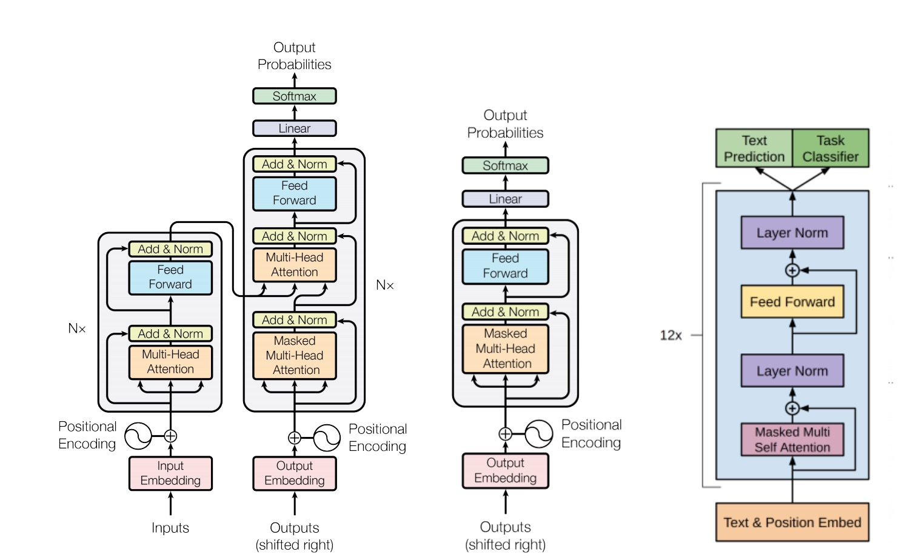

# TFMR

This repository provides a modified implementation of the *decoder* component of the architecture described in the paper: *Attention is all you need* [1]. In addition, example usage is provided with a character level language model.

The architecture implemented in this repository is similiar to that described in the paper: *Improving Language Understanding by Generative Pre-Training* [2], in that it can be thought of as a standalone *decoder* component from [1] that omits the attention layer which interfaces with an encoder. However, whereas the implementation in [2] makes some additional architectural changes, this implementation stays true to the original description in [1].

**Figure 1:** *Left: The original transformer from [1], Middle: The implementation in this repository, Right: OpenAI's transformer from [2].*

### What's in the box?

- Keras/Tensorflow implementation of the architecture in **Figure 1**.
- Character level language model for generating plausible drug names.

### Quickstart

1. `git clone git@github.com:coxy1989/superconv.git`

2. `cd tfmr` 

3. `conda env create -f environment.yml`

3. `source activate tfmr`

4. `python rx.py`

## References

[1] Vaswani et al. Attention Is All You Need. [arXiv:1706.03762](https://arxiv.org/pdf/1706.03762.pdf), 2017.

[2] Radford et al. Improving Language Understanding by Generative Pre-Training. [OpenAI](https://s3-us-west-2.amazonaws.com/openai-assets/research-covers/language-unsupervised/language_understanding_paper.pdf), 2018.
